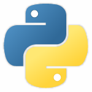

# Pchain

## Project Summary

**Pchain** is a blockchain infrastructure written Python and Vue.JS.

The blockchain has all the basic feature expected by a distributed ledger such as **cryptography**, **mining**, **coins**, **wallets**/**node creation** and **consensus**.

The user can:
- create nodes
- create personal wallets
- mine blocks
- send coins to other users

and the blockchain can manage themself solving manipulation problems.

The code follows the Python **pep8** style guide.

### Live Demo

(coming soon)

## Technologies Used

- **Phyton 3.6**
- **Vue.JS**
- **Axios**
- **Flask**
- **Requests**
- **pCrypto**
- **Anaconda Cloud**

---

During the development process I used also the following tools:

- **Postman**: to test the API
- **Visual Studio Code**: GUI
- **Photoshop CC**: as photo editor

## Possible Further Developments

**v2.0**
Improve scalability

## How to run the application locally

- Clone the repository
- Install the following packages: Flask, Requests, pCrypto
- Run `python node.py -p 3000` (change the port to create new nodes)